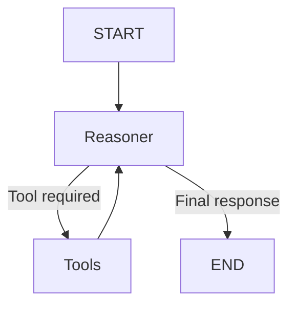

# Agentic Travel Assistant

An intelligent travel assistant that combines **LangGraph-based agent orchestration**, external travel APIs, semantic retrieval, and Retrieval-Augmented Generation (RAG) to support end-to-end travel assistance.

The system dynamically selects specialized tools for:

1. Flight search
2. Hotel search
3. Restaurant recommendations
4. Weather information
5. Currency exchange information
6. Travel FAQ retrieval
7. Multi-day trip planning

The project integrates **LangGraph**, **LanceDB**, **Amadeus**, **Tavily Search**, **LlamaParse**, and sentence-transformer embeddings to build an agent capable of reasoning over user requests and invoking the appropriate travel service.

---

## Project Overview

The assistant is implemented as a tool-enabled conversational agent with a **ReAct-style workflow**.

The language model acts as the reasoning component and determines whether a user request can be answered directly or requires one of the available travel tools.

The main stages of the project include:

* Environment and API configuration
* Airport and currency dataset preparation
* Travel FAQ processing
* Travel-guide PDF parsing
* Semantic embedding generation
* LanceDB vector database construction
* Flight-search tool implementation
* Hotel-search tool implementation
* Restaurant-search tool implementation
* Weather-information retrieval
* Currency-information retrieval
* FAQ semantic search
* RAG-based trip planning
* LangGraph agent construction
* Interactive command-line interface
* Multi-scenario agent evaluation

---

## Agent Architecture

The travel assistant follows a LangGraph workflow composed of two main operational nodes:

* **Reasoner Node** — interprets the conversation, selects tools, and generates final responses
* **Tools Node** — executes tool calls requested by the language model

The workflow repeatedly alternates between reasoning and tool execution until the model produces a final answer.



Conversation history is maintained using `MessagesState`.

The system message provides:

* Tool-selection rules
* Tool descriptions and expected inputs
* Date-handling rules
* Currency normalization instructions
* RAG usage preferences
* Error-handling behavior
* Response-generation guidelines

---

## Available Travel Tools

### 1. Flight Search

The flight-search tool uses the **Amadeus API** to retrieve flight offers between two cities.

Inputs include:

* Origin city
* Destination city
* Departure date
* Number of adults
* Maximum number of results

City names are converted to candidate IATA airport codes using a city-to-IATA mapping.

Natural-language date expressions such as:

```text
tomorrow
next Sunday
in 3 days
15 Jan 2027
```

are normalized into the `YYYY-MM-DD` format required by the API.

Returned flight information can include:

* Airline code
* Flight number
* Price
* Currency
* Departure time
* Arrival time
* Flight duration
* Number of stops

When multiple airport codes exist for a city, candidate airport combinations are tested in priority order.

---

### 2. Hotel Search

The hotel-search tool uses **Amadeus Hotel APIs** to retrieve accommodation options for a destination.

Inputs include:

* Destination city
* Check-in date
* Check-out date
* Number of adults
* Optional maximum nightly budget
* Optional preferred currency

The tool retrieves hotel metadata and available offers and calculates an estimated price per night based on the stay duration.

Returned information can include:

* Hotel name
* Rating
* Price per night
* Currency
* Address
* Geographic coordinates

If usable hotel information cannot be retrieved from Amadeus, **Tavily Search** is used as a web fallback.

---

### 3. Restaurant Search

Restaurant recommendations are retrieved using the **Tavily Search API**.

The tool accepts a destination and searches for a diverse selection of:

* Local restaurants
* Popular dining venues
* Cafés
* Regional cuisine
* Notable food experiences

Returned recommendations can include:

* Restaurant name
* Cuisine
* Description
* Destination
* Source URL

The search response is validated and converted into a consistent structured format before being returned to the agent.

---

### 4. Weather Information

The weather tool retrieves destination-specific weather information through Tavily web search.

Inputs include:

* Destination
* Date

The requested date is normalized before weather-related search queries are generated.

The tool attempts to extract:

* Weather condition
* Temperature
* High temperature
* Low temperature
* Humidity
* Probability of precipitation

Weather descriptions are processed using regular-expression patterns and lightweight text analysis.

Based on the retrieved conditions, the tool also generates clothing recommendations such as:

* Light clothing
* Layered clothing
* Heavy jackets
* Rain protection
* Sun protection
* Travel caution for severe weather

---

### 5. Currency Information

The currency tool retrieves current exchange-rate information using Tavily Search.

User inputs may contain:

* Country names
* Country aliases
* Currency names
* ISO 4217 currency codes

The agent is instructed to normalize currency identifiers to corresponding countries before invoking the tool.

Examples:

```text
USD → United States of America
AED → United Arab Emirates
GBP → United Kingdom
JPY → Japan
IRR → Iran
```

A second normalization layer inside the tool resolves the final ISO 4217 currency code.

The tool can return:

* Base currency
* Quote currency
* Exchange rate
* Reverse exchange rate
* Human-readable conversion text
* Source information

Example:

```text
1 USD = 3.67 AED
1 AED = 0.2725 USD
```

---

### 6. FAQ Search

The FAQ tool implements semantic retrieval over a local travel FAQ knowledge base.

FAQ question-answer pairs are embedded using:

```text
BAAI/bge-small-en-v1.5
```

and stored in a dedicated **LanceDB** table.

When a user submits a travel-related question, the query is embedded with the same model and compared against the stored FAQ vectors.

The two most relevant question-answer pairs are retrieved.

Example requests include:

```text
How do I get a visa?

What documents do I need for international travel?

How early should I arrive at the airport?
```

This enables semantically similar questions to be matched even when the wording differs from the original FAQ entries.

---

### 7. Trip Planning

The trip-planning tool creates a structured multi-day itinerary using **RAG over the travel-guide knowledge base**.

Inputs include:

* Destination
* Arrival date
* Departure date
* Optional interests

Possible interests include:

```text
culture
food
nature
shopping
adventure
nightlife
```

Multiple semantic queries are generated for each destination, including:

* Main attractions
* Local food
* Activities
* Areas to stay
* Transportation
* Interest-specific experiences

Retrieved travel-guide content is organized into thematic categories and distributed across itinerary days.

The resulting plan can contain:

* Morning activities
* Afternoon activities
* Evening activities
* Food suggestions
* Daily notes
* Accommodation-area recommendations
* Transportation tips
* Destination highlights
* Local-food recommendations

The itinerary logic tracks previously selected retrieval items so the same recommendations are not repeatedly assigned to multiple days.

When the local RAG knowledge base has insufficient coverage, Tavily Search can provide supplementary web information.

---

## Data Sources

### IATA Airport Dataset

Airport information is obtained from the Kaggle dataset:

```text
zinovadr/iata-airport-code
```

The dataset is processed to build a mapping from normalized city names to candidate IATA airport codes.

For cities containing multiple airports, airport codes are retained in priority order.

Example:

```text
Dubai → DXB
Tehran → THR / IKA
```

depending on the airport entries available in the source dataset.

---

### Currency Reference Dataset

Currency information is loaded from:

```text
data/list-one.csv
```

The dataset contains country and territory information together with currency names and ISO-style alphabetic currency codes.

Relevant fields include:

* `ENTITY`
* `Currency`
* `Alphabetic-Code`

The dataset is used to build country-to-currency and currency-name-to-code mappings.

---

### Travel FAQ Dataset

Frequently asked travel questions are stored locally in:

```text
data/FAQ.js
```

The dataset covers common travel topics such as:

* Passports
* Visas
* Travel documents
* Airport procedures
* Baggage
* Travel insurance
* Flight changes
* Travel safety

FAQ records are embedded and stored in LanceDB for semantic retrieval.

---

### World Travel Book

A travel-guide PDF is used as the unstructured knowledge source for trip planning.

The document is processed using **PyPDF2** and **LlamaParse**.

Selected pages are first extracted for table-of-contents analysis. Country and city information is then identified and used to organize the main travel-guide content.

The processed guide is converted into structured records containing fields such as:

* Country
* City
* Travel text

These records are subsequently embedded and indexed in LanceDB.

> The travel-guide PDF is used as a local project dependency and is not included in the public repository. Users must provide their own legally obtained copy as `World_Travel_Book.pdf` in the repository root.

---

## Vector Database

The project uses **LanceDB** for semantic retrieval.

Two separate vector tables are created.

### FAQ Table

The FAQ schema stores:

```text
id
question
answer
text_for_embedding
vector
```

Questions and answers are combined before embedding to provide richer semantic representations.

---

### Travel Book Table

The travel-guide schema stores:

```text
id
country
city
text
vector
```

Travel-guide text chunks are embedded independently and used by the trip-planning RAG pipeline.

---

## Embedding Model

Both vector databases use:

```text
BAAI/bge-small-en-v1.5
```

through the `sentence-transformers` library.

Embeddings are normalized before storage.

The resulting vectors contain:

```text
384 dimensions
```

Semantic similarity search is then performed directly through LanceDB.

---

## Date Handling

Several travel APIs require ISO-formatted dates, while users normally provide dates in natural language.

The project includes a shared date-normalization utility supporting expressions such as:

```text
today
tomorrow
next Friday
in 3 days
in 2 weeks
December 18 2027
2027-12-18
```

Dates are normalized internally into:

```text
YYYY-MM-DD
```

The system prompt instructs the language model to pass the user's original date expression to the appropriate tool and treat normalized dates returned by tools as authoritative.

---

## LangGraph Workflow

The seven tools are bound to an OpenAI-compatible chat model using LangChain tool calling.

```python
TOOLS_TO_BIND = [
    search_flights_amadeus,
    search_hotels_amadeus,
    search_restaurants_by_destination,
    get_weather_info_tavily,
    get_currency_info_tavily,
    faq_search,
    trip_planning,
]
```

The Reasoner Node receives:

* System instructions
* Conversation history
* Previous tool results

and decides whether another tool call is needed.

If the model generates a tool call, LangGraph routes execution to the Tools Node.

After execution, the tool result returns to the Reasoner Node.

The workflow ends when the model produces a response without requesting another tool.

---

## Command-Line Interface

An interactive CLI is provided for testing the complete agent.

The interface supports:

```text
exit
clear
```

During each interaction, the CLI:

1. Reads user input
2. Adds it to conversation history
3. Invokes the LangGraph application
4. Detects tools used during the turn
5. Displays the selected tool names
6. Prints the assistant response

`clear` resets both the terminal view and the active conversation history.

---

## Agent Evaluation

The project contains an end-to-end evaluation suite with **14 test scenarios**.

Each of the seven tools is tested with two different user requests.

| Tool                 | Scenarios |
| -------------------- | --------: |
| Flight Search        |         2 |
| Hotel Search         |         2 |
| Restaurant Search    |         2 |
| Weather Information  |         2 |
| Currency Information |         2 |
| FAQ Search           |         2 |
| Trip Planning        |         2 |
| **Total**            |    **14** |

For every scenario, the evaluation framework records:

* User query
* Expected tool
* Tools actually selected
* Final assistant response
* Tool-selection result
* Lightweight response-quality check
* Execution errors when present
* Overall pass/fail status

An individual scenario failure does not terminate the complete evaluation suite, allowing all scenarios to be tested in a single run.

---

## Repository Structure

```text
agentic-travel-assistant/
│
├── World_Travel_Book.pdf          # Local only — excluded from Git
│
├── data/
│   ├── FAQ.js
│   └── list-one.csv
│
├── travel_agent/
│   └── travel_agent.ipynb
│
├── .env.example
├── .gitignore
├── requirements.txt
└── README.md
```

The travel-guide PDF and generated runtime artifacts are excluded from version control.

---

## Environment Variables

The project requires several external API credentials.

Create a local `.env` file using `.env.example` as a template.

```env
TAVILY_API_KEY=your_tavily_api_key_here

AMADEUS_CLIENT_ID=your_amadeus_client_id_here
AMADEUS_CLIENT_SECRET=your_amadeus_client_secret_here

OPENAI_API_KEY=your_openai_compatible_api_key_here
OPENAI_BASE_URL=https://api.avalai.ir/v1

LLAMA_PARSE_API_KEY=your_llama_parse_api_key_here
```

Do not commit the `.env` file or real API credentials to version control.

---

## Technologies

* Python
* LangGraph
* LangChain
* OpenAI-compatible Chat API
* Amadeus API
* Tavily Search
* LanceDB
* Sentence Transformers
* BAAI/bge-small-en-v1.5
* LlamaParse
* LlamaIndex
* PyPDF2
* Pandas
* NumPy
* PyArrow
* Dateparser
* FuzzyWuzzy
* python-Levenshtein
* KaggleHub
* Matplotlib
* Pillow
* Jupyter Notebook

---

## Installation

Clone the repository:

```bash
git clone https://github.com/Hamidreza-Talei/agentic-travel-assistant.git
cd agentic-travel-assistant
```

Create a virtual environment:

```bash
python -m venv venv
```

Activate it on Windows:

```bash
venv\Scripts\activate
```

On macOS or Linux:

```bash
source venv/bin/activate
```

Install the required packages:

```bash
pip install -r requirements.txt
```

---

## Local Travel-Guide Setup

The project requires a local copy of:

```text
World_Travel_Book.pdf
```

Place it in the repository root:

```text
agentic-travel-assistant/
├── World_Travel_Book.pdf
├── data/
├── travel_agent/
└── ...
```

The notebook accesses the document from:

```python
PDF_NAME = "../World_Travel_Book.pdf"
```

The file is intentionally excluded from Git and should not be committed.

---

## Running the Project

Start Jupyter Notebook:

```bash
jupyter notebook
```

Open:

```text
travel_agent/travel_agent.ipynb
```

Run the notebook cells in order.

The notebook will:

1. Load environment variables
2. Prepare the airport and currency mappings
3. Load the travel FAQ dataset
4. Parse the travel-guide document
5. Construct the LanceDB vector tables
6. Define all seven travel tools
7. Bind the tools to the language model
8. Construct the LangGraph workflow
9. Compile and visualize the graph
10. Start or demonstrate the CLI
11. Execute the evaluation scenarios

---

## Generated Files

Running the notebook may generate:

```text
lancedb_travelbot/
temp_pages_4_to_7.pdf
cleaned_World_Travel_Book.pdf
world_travel_book.csv
```

These files contain generated indexes, extracted document sections, or intermediate processing results and are excluded from version control.

---

## Example Requests

### Flight Search

```text
Find flights from Tehran to Dubai next Sunday.
```

### Hotel Search

```text
Find a hotel in Paris for two adults with a maximum budget of 2000 AED per night.
```

### Restaurant Search

```text
Recommend local food places in Rome.
```

### Weather Information

```text
What will the weather be like in Tehran next Sunday?
```

### Currency Information

```text
What is the USD to AED exchange rate today?
```

### FAQ Search

```text
What documents do I need for international travel?
```

### Trip Planning

```text
Create a 4-day itinerary for Paris focused on food and culture.
```

---

## Error Handling

The tools include defensive handling for common failure conditions such as:

* Missing user inputs
* Invalid city names
* Missing IATA mappings
* Invalid date ranges
* Missing environment variables
* API failures
* Empty Amadeus responses
* Tavily retrieval failures
* Missing LanceDB tables
* Invalid structured search responses
* Missing exchange-rate patterns
* Incomplete hotel pricing metadata

Where appropriate, fallback mechanisms are used instead of immediately terminating the workflow.

---

## Limitations

This project is an agentic travel-assistant prototype and has several practical limitations.

### External API Availability

Flight and hotel results depend on the availability and coverage of the Amadeus API environment being used.

Sandbox environments may provide fewer results than production APIs.

### Web-Derived Information

Restaurant, weather, and currency information is retrieved from web-search results.

Therefore:

* Results may vary between runs.
* Information can differ between sources.
* Exchange rates may not exactly match financial-market execution rates.
* Weather values may vary depending on the provider and forecast update time.

### Weather Parsing

Weather information is extracted from retrieved text using heuristic regular-expression patterns.

Different source formats may occasionally prevent some fields from being detected.

### Travel-Guide Retrieval

Trip planning depends on the content available in the local travel-guide knowledge base.

Destination coverage and recommendation quality are therefore influenced by the source document and parsing quality.

### Itinerary Generation

The itinerary generator distributes retrieved content across available days using rule-based categorization.

It does not perform full geographic route optimization, opening-hour validation, reservation checking, or travel-time optimization between attractions.

### Tool Selection

Tool selection is performed by a language model.

Although the system prompt defines explicit routing rules, language-model behavior may still vary for ambiguous requests.

---

## Key Concepts

This repository demonstrates:

* Agentic AI
* Large Language Models
* LangGraph
* ReAct-style agents
* Tool calling
* Agent orchestration
* Conversational state
* Retrieval-Augmented Generation
* Semantic search
* Vector databases
* LanceDB
* Sentence embeddings
* Sentence Transformers
* BGE embeddings
* PDF parsing
* LlamaParse
* Structured data processing
* Natural-language date normalization
* IATA airport-code resolution
* ISO 4217 currency resolution
* Fuzzy matching
* Web search integration
* Amadeus travel APIs
* Tavily Search
* API fallback strategies
* Prompt engineering
* Error handling
* CLI development
* End-to-end agent evaluation
* Automated tool-selection testing

---

## Project Scope

The goal of this project is to demonstrate how multiple retrieval systems, external APIs, structured datasets, and specialized tools can be combined into a unified conversational travel agent.

Rather than relying on a single information source, the system dynamically routes requests to the most appropriate capability while maintaining one conversational interface.

The project focuses on the complete **agentic AI pipeline**:

```text
User Request
     ↓
Reasoning
     ↓
Tool Selection
     ↓
External API / Web Search / RAG
     ↓
Tool Observation
     ↓
Reasoning
     ↓
Final Response
```
